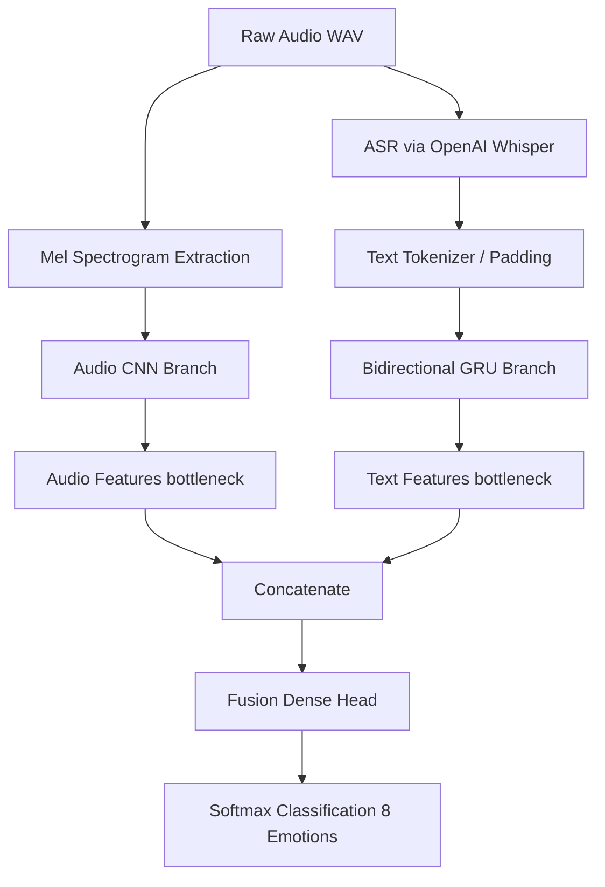

# Multimodal Emotion Recognizer

An advanced speech and text multimodal emotion recognition pipeline trained on the RAVDESS dataset. This project leverages Audio CNNs (for Mel-Spectrogram features) and Text Bi-GRUs (for transcription semantics) to perform multimodal classification of human emotions.

---

## Key Features

* Dual-Input Architecture: Combines raw audio signals and transcribed text text-features using both Early Fusion and Late Fusion strategies.
* OpenAI Whisper Integration: Automatically transcribes audio utterances into text using the Whisper base model.
* Audio Data Augmentation: Enhances model generalization using pitch shifting, time stretching, and Gaussian noise injection.
* Advanced Mel-Spectrogram Extraction: Employs Librosa to extract standard log-frequency power spectrograms with per-sample normalization.
* Transfer Learning & Multi-Phase Fine-Tuning: Trains unimodal branches first, transfers their weights into the fusion network, trains the fusion head with frozen branches, and finally fine-tunes the entire network at a very low learning rate.

---

## Architecture Overview

The system processes a speech signal simultaneously through two pipelines:



### 1. Unimodal Audio Branch (CNN)
* Processes 128 x 128 x 1 normalized Mel-Spectrograms.
* Built using sequential Conv2D layers with Batch Normalization, ReLU activation, and Spatial Dropout.
* Concatenates Global Average Pooling and Global Max Pooling outputs to capture both global structure and peak emotional cues.

### 2. Unimodal Text Branch (Bi-GRU)
* Processes Whisper-generated transcripts padded to a sequence length of 40 words.
* Embedding layer followed by a 3-layer stack of Gated Recurrent Units (GRUs).

### 3. Fusion Strategies
* Early Fusion: Concatenates bottleneck features of both branches and passes them through a dense classifier. Optimized using two-phase training (unimodal freeze followed by full fine-tuning).
* Late Fusion: Employs ensemble voting over unimodal probabilities:
  * Simple Average
  * Weighted Average (0.7 * Audio + 0.3 * Text)
  * Max Confidence prediction

---

## Dataset & Emotions

The pipeline is developed and validated on the RAVDESS (Ryerson Audio-Visual Database of Emotional Speech and Song) dataset:
* Total files: 2,880 samples
* Classes mapped (8 emotions):
  1. neutral
  2. calm
  3. happy
  4. sad
  5. angry
  6. fearful
  7. disgust
  8. surprised

---

## Setup & Installation

### Requirements
* Python 3.8+
* GPU support (highly recommended for Whisper transcription and CNN training)

### Install Dependencies
```bash
pip install librosa openai-whisper tensorflow scikit-learn matplotlib seaborn soundfile
```

### Running the Pipeline
Open the Jupyter notebook inside your environment (or upload it directly to Google Colab with GPU runtime enabled):
```bash
jupyter notebook "EPOCH (4).ipynb"
```

---

## Model Performance & Evaluation

The training pipeline tracks and saves metrics to output clear comparative results:

| Model / Fusion Method | Test Accuracy |
| :--- | :---: |
| Text RNN (unimodal) | ~15% - 20% (RAVDESS text is neutral and actor-invariant) |
| Audio CNN (unimodal) | **~84.8%** |
| **Early Fusion** (Fine-tuned) | **~85.2%** |
| Late Fusion (Weighted 0.7/0.3) | **~84.9%** |

*Note: Since the text script in RAVDESS is fixed (e.g. "Kids are talking by the door"), the textual content itself does not carry rich emotional markers. Thus, the Audio CNN branch dominates prediction, but early/late fusion still helps extract subtle micro-transcription markers.*

### Outputs Saved
* `/content/training_curves.png`: Training vs. Validation Loss curves.
* `/content/confusion_matrix.png`: Emotion classification confusion matrix.
* `/content/transcripts.json`: Extracted Whisper transcripts.
